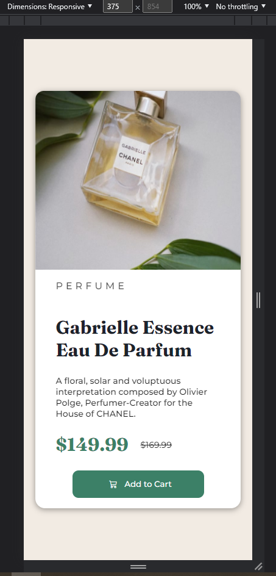

# Frontend Mentor - Product preview card component solution

This is a solution to the [Product preview card component challenge on Frontend Mentor](https://www.frontendmentor.io/challenges/product-preview-card-component-GO7UmttRfa). Frontend Mentor challenges help you improve your coding skills by building realistic projects.

## Table of contents

- [Overview](#overview)
  - [Screenshot](#screenshot)
  - [Links](#links)
- [My process](#my-process)
  - [Built with](#built-with)
- [Author
  ](#author)

## Overview

### Screenshot

### Links

- Solution URL:
- Live Site URL:  https://silver-pony-f59b41.netlify.app/

## My process

### Built with

- Semantic HTML5 markup
- CSS custom properties
- Flexbox
- Mobile-first workflow

## Author

- Website - [L](https://www.your-site.com)eonardo Spadavecchia
- Frontend Mentor - Spadavecchia-LM
- Twitter - [@L](https://www.twitter.com/yourusername)eospadavecchia
